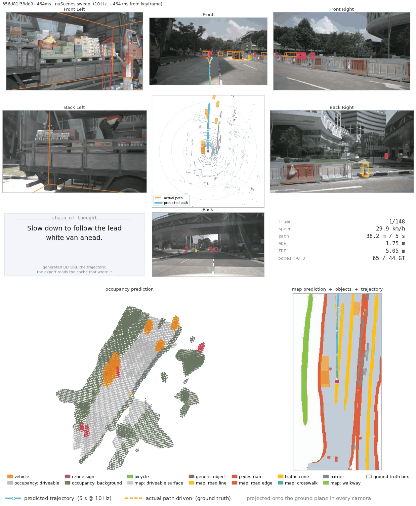
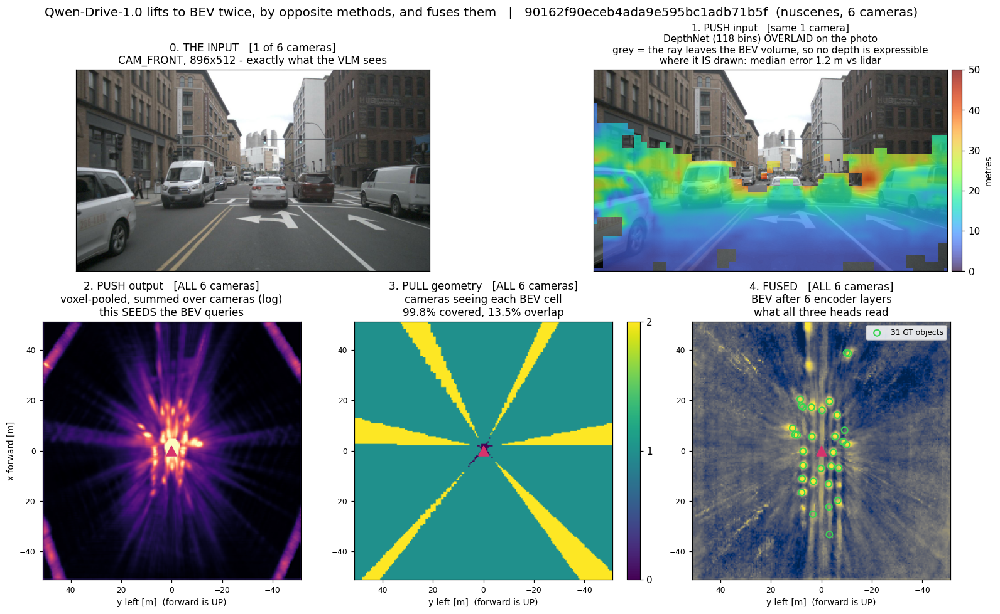

<p align="center">
  
</p>

<h3 align="center">Qwen-Drive-1.0 — studied, trained, and exported to ONNX</h3>

<p align="center">
  A working <b>training pipeline</b> for a release that cannot back-propagate ·
  the <b>whole model exported to ONNX</b> and validated numerically against PyTorch ·
  and a walk through how the 3D perception actually works.
</p>

<p align="center">
  <a href="SETUP.md"><b>SETUP.md</b></a> ·
  <a href="TRAINING.md"><b>TRAINING.md</b></a> ·
  <a href="ONNX_EXPORT.md"><b>ONNX_EXPORT.md</b></a> ·
  <a href="study/00_START_HERE.md"><b>study/</b></a> ·
  <a href="README_UPSTREAM.md">upstream README</a>
</p>

---

<p align="center">
  
</p>

<p align="center">
  <sub>A nuScenes session at 0.75x speed &mdash; first 12 s, full 1238&times;1505 resolution.
  Camera ring with the predicted trajectory projected into every view, the lidar BEV, and
  the chain of thought the model writes <i>before</i> the trajectory. Bottom row:
  <b>semantic occupancy</b> on the left, and on the right the <b>online map with every
  detected object and the predicted path drawn on it</b> &mdash; the three heads in one
  picture, where they either agree or visibly do not. Full clips:
  <code>outputs/nuscenes_session_map_1.0x.mp4</code> (real time) and
  <code>..._0.75x.mp4</code>.</sub>
</p>

---

## What is in here

This is a clone of [Qwen-Drive-1.0](https://github.com/QwenLM/Qwen-Drive-1.0) plus
three things the release does not ship:

| | |
|---|---|
| **[SETUP.md](SETUP.md)** | reproduce this on another machine. The additions are 1.2 MB; everything else downloads or regenerates. |
| **[TRAINING.md](TRAINING.md)** | the staged recipe from arXiv:2609.00111, implemented and verified. Stages 1-3 pass; stage 4 (RL) needs a simulator that is not public. |
| **[ONNX_EXPORT.md](ONNX_EXPORT.md)** | every component exported - 73 graphs, 54 GiB - and both driving pipelines validated end to end against PyTorch. |
| **[study/](study/00_START_HERE.md)** | 12 documents on how the model works, built by instrumenting live forwards rather than reading code. |

Upstream code in `src/` and `scripts/` is **unmodified** except for one CPU
fallback in `src/qwen_drive_perception/ops/__init__.py`. Everything added lives in
`training/`, `export_onnx/`, `study/` and `local/`.

---

## 0. End-to-end data flow — all three modes on one page

```
╔═══════════════════════════════════════════════════════════════════════════════════════╗
║                          THE SHARED VLM — Qwen3.5-4B                                  ║
║                    4.5393 B params · one copy · never modified                        ║
╚═══════════════════════════════════════════════════════════════════════════════════════╝

  PLANNING INPUT                             │        PERCEPTION INPUT
  3 views × 4 timesteps = 12 images          │        the whole camera ring, 1 timestep
  <FRONT> <FRONT LEFT> <FRONT RIGHT>         │        6 cams (nuScenes) or 8 cams (nuPlan)
  history 26×24 grid → 156 tok  (×9)         │        each 896×512 → 32×56 grid → 448 tok
  current 50×44 grid → 550 tok  (×3)         │
        └─ 3054 image + 331 text = 3385 tok  │        └─ 3584 image + 70 text = 3654 tok (8 cam)
                                             │           2688 image + 56 text = 2744 tok (6 cam)
                    │                        │                     │
                    ▼                        │                     ▼
        ┌───────────────────────────────────────────────────────────────────┐
        │  VISION TOWER  model.visual   333.514 M  (7.35 %)                  │
        │  24 blocks · width 1024 · 16 heads · patch 16 · temporal patch 2   │
        │  merge 2×2 → out_hidden 2560 ·  deepstack_visual_indexes = []      │
        │  pixel_values row = 3 ch × 2 temporal × 16 × 16 = 1536             │
        └──────────┬──────────────────────────────────┬─────────────────────┘
                   │ post-merge tokens                │ PRE-MERGE patches, after
                   │                                  │ merger.norm  ── PERCEPTION TAP 1
                   ▼                                  │  [N_cam, 32, 56, 1024]
        ┌───────────────────────────────────────────────────────────────────┐
        │  LANGUAGE MODEL  4205.751 M  (92.65 %)   32 layers · width 2560   │
        │  vocab 248 320 · embed 635.70 M · tie_word_embeddings = True      │
        │  mRoPE interleaved, sections [11, 11, 10], θ = 1e7, partial 0.25  │
        │                                                                   │
        │  HYBRID STACK — layer_types alternate 3:1                         │
        │   ├ 24 × linear_attention  (Gated DeltaNet)     112.9 M each      │
        │   │     in_proj_qkv 8192 = q 16×128 ⊕ k 16×128 ⊕ v 32×128        │
        │   │     in_proj_z 4096 gate · conv1d (8192,1,4) · A_log/dt_bias   │
        │   │     ► NO KV CACHE — a recurrent state, not keys and values    │
        │   │                                                               │
        │   └  8 × full_attention  at layers [3,7,11,15,19,23,27,31]        │
        │         q_proj 8192 = query 16×256 ⊕ OUTPUT GATE 16×256           │
        │         k_proj/v_proj 1024 = 4 kv heads × 256   (GQA 4:1)         │
        │         q_norm/k_norm per-head RMSNorm over head_dim 256          │
        │         ► these 8 are the ONLY layers that leave a KV cache       │
        └───────┬───────────────────────────────┬───────────────────────────┘
                │                               │ final norm applied explicitly,
                │                               │ image-token rows only
                │                               │  ── PERCEPTION TAP 2
                │                               │  [N_cam, 16, 28, 2560]
                │                               ▼
                │              ┌──────────────────────────────────┐
                │              │  BEV PERCEPTION HEAD             │
                │              │  125.064 M · fp32 · §3           │
                │              └──────────────────────────────────┘
                │
        ┌───────┴────────────────────────────────────────────────┐
        │                                                        │
        ▼ VQA mode                                               ▼ PLANNING modes
   the LLM decoder, unchanged.                        8 KV caches, one per full-
   greedy-equivalent decoding                         attention layer, each
   (temp 0.01, top_k 1)                               [1, 3385, 4 heads, 256]
   → text                                                        │
                                                                 ▼
                              ┌────────────────────────────────────────────────────┐
                              │  PLANNING EXPERT  1.0398 B  ·  §2                  │
                              │  32 layers × 31.990 M · width 1024 · mlp 3584      │
                              │  10 Euler steps of flow matching                   │
                              └────────────────────────────────────────────────────┘
                                                                 │
                                          OUTPUT ►  [num_samples, 50, 3]
                                          (x, y, heading) · 5 s @ 10 Hz · ego frame
```

The two **taps** are the whole trick. Geometry is read from the ViT *before* the
2×2 merge and needs only a 0.853 M neck; meaning is read from the LLM's last
layer and needs a 33.663 M adaptor — a **39× asymmetry** that says the pre-merge
patches are already close to what a view transform wants.
Details: [study/01](study/01_MODEL_STRUCTURE.md), [study/07](study/07_PUSH_AND_PULL.md).

---

## 1. Training

**The release cannot back-propagate.** Two custom CUDA kernels ship forward-only:
`_VoxelPoolDepthCuda` is a `torch.autograd.Function` with no `backward`, and
`ms_deform_attn_bf16_forward` is not wrapped in one at all. That is *why* there is
no training code. `training/differentiable.py` routes both to their differentiable
pure-PyTorch twins, and then everything else follows.

```bash
export PYTHONPATH=src:. PATH="$PWD/.venv/bin:$PATH"

.venv/bin/python training/cache_features.py          # cache the frozen VLM's taps
.venv/bin/python training/run_all_stages.py          # every stage, PASS/FAIL
```

```
PASS  gradient test WITHOUT the patch (failing IS the pass)      7s
PASS  gradient test WITH the patch                              10s
PASS  stage 1 - perception head, overfit one frame             527s
PASS  stage 3 - planning expert, overfit from scratch           68s
PASS  stage 2 - joint perception + VLM (LoRA)                  152s
5/5 stages passed
```

| stage | what trains | result |
|---|---|---|
| 1 perception head | BEV head, VLM frozen | loss **15.5 → 3.4** |
| 2 joint | head + VLM (LoRA) | **15.4 → 9.5**, gradient reaches the VLM |
| 3 planning expert | flow matching, VLM frozen | **0.0079 → 0.0001** |
| 4 RL | — | **not implemented**: needs closed-loop PDMS, not public |

Losses are quoted from the paper, not inferred:

```
L_perc = L_det + L_occ + L_map
L_det  = sum_{l=1..6} ( 2·L_focal + 0.75·L_l1 )     L_occ = 100·L_focal + L_geo + L_sem + L_lov
L_map  = 100·L_focal + L_lov                        L_plan = L_fm + 2e-4·L_d1 + 2e-5·L_d2
```

On two GPUs the right parallelism **differs per stage** — DDP gives stage 1 a clean
2×, but makes stage 3 **1.7× slower** (2.1 GiB all-reduced against 0.21 s of
compute, with no NVLink). Stage 2 instead splits by *module*, which makes the
vision encoder trainable at lower peak memory. Full detail and every command:
**[TRAINING.md](TRAINING.md)**.

---

## 2. ONNX export

The whole model is exported and validated: **73 graphs, 54 GiB**.

```bash
.venv/bin/python export_onnx/run_onnx_pipeline.py --phase run      # perception
.venv/bin/python export_onnx/run_onnx_pipeline.py --phase compare
.venv/bin/python export_onnx/run_onnx_planner.py  --phase run      # planning
.venv/bin/python export_onnx/run_onnx_planner.py  --phase compare
```

```
PERCEPTION   PIPELINE PASS  (worst 1.17e-03, tolerance 5e-03)
PLANNING     ADE 0.00002 m   FDE 0.00004 m   PASS
```

| graph | nodes | vs PyTorch |
|---|---|---|
| VLM vision tower | 3,747 | 7.1e-05 |
| VLM text prefill, 33 per-layer graphs | 344,127 | 1.4e-06 |
| VLM decode step | 10,233 | 2.0e-06 |
| BEV perception head | 12,436 | 5.3e-04 |
| Planning expert step | 9,315 | 4.2e-07 |

**There is no single .onnx file, and that is a runtime limit.** The monolithic
prefill *does* export (341,977 nodes) but onnxruntime cannot build a session from
it. Session creation is **quadratic** in node count — measured 0.27 → 0.57 → 1.49
s per 1k nodes as the graph doubles — so 32 layers extrapolates to ~65 minutes,
which is exactly what it did. Split into 33 graphs it loads in ~2 minutes.

The bug worth knowing: `index_add` with duplicate indices exported *silently
wrong*. Voxel pooling is nothing but duplicate indices, and the graph passed
`onnx.checker`, ran, and returned **relative error 0.96**. Switching to
`scatter_add` took it to 5.3e-04. Full detail: **[ONNX_EXPORT.md](ONNX_EXPORT.md)**.

---

## 3. How the 3D perception works

The model lifts to BEV **twice, by opposite methods**, and fuses them:

* **push** (LSS/UVTR) — each image patch guesses a depth *distribution* over 118
  bins and scatters its feature along the ray. The streaks in the BEV are that
  uncertainty made visible; it is a weighted backprojection, the same operation
  as unfiltered backprojection in CT.
* **pull** (BEVFormer) — each of 200×200 BEV cells projects itself into all
  cameras by calibration alone and samples what is there.

Push knows *what* and guesses *where*; pull knows *where* and must ask *what*. So
push's output becomes pull's starting value — one line, `bev_queries =
bev_embedding.weight + uvtr_bev_feat`.

<p align="center"></p>

Start at [study/00_START_HERE.md](study/00_START_HERE.md), or jump to
[07_PUSH_AND_PULL.md](study/07_PUSH_AND_PULL.md) if "push" and "pull" are words
rather than pictures.

---

## 4. Layout

```
TRAINING.md          the recipe and every command to train
ONNX_EXPORT.md       the full export and how to validate it
README_UPSTREAM.md   the original Qwen-Drive README

training/            differentiable.py (the enabler), losses, 3 stages, multi-GPU
export_onnx/         exporters, geometry freezing, end-to-end runners
study/               12 documents + scripts that print live numbers
local/               demo runners, video tools, analysis
.vscode/launch.json  61 one-keypress configs for everything above
```

Reproduce any number: `.venv/bin/python study/scripts/12_collect_results.py`
regenerates `outputs/expected_results.json`, and
[study/10_EXPECTED_RESULTS.md](study/10_EXPECTED_RESULTS.md) says what counts as
a regression.

---

## Attribution

Model, weights and `src/` are by the Qwen Team and Huazhong University of Science
and Technology — see [README_UPSTREAM.md](README_UPSTREAM.md) and
[arXiv:2609.00111](https://arxiv.org/abs/2609.00111). Licence unchanged
([LICENSE](LICENSE)).
